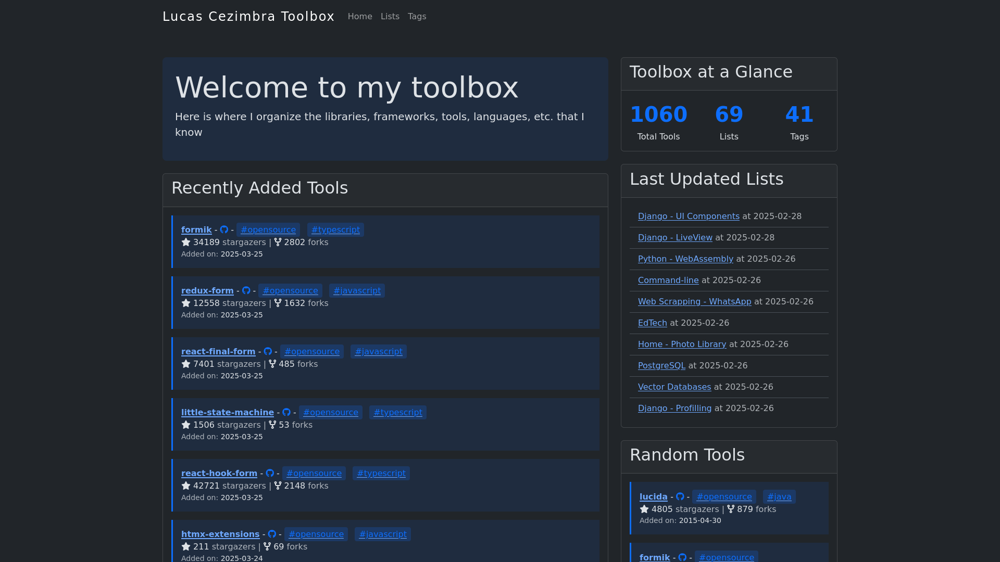

# Toolbox



## Installation
```bash
git clone git@github.com:lucasrcezimbra/toolbox.git
cd toolbox
make install
```

### Test
```bash
make test
```

### Run
```bash
make dev
```

### Collect data
```bash
make collectdata github=<your-github-username>
```
